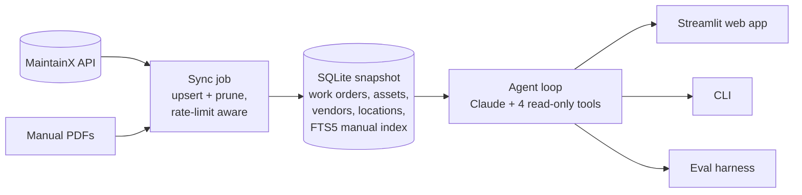

# Maintenance History Assistant

**A tool-using LLM agent that answers technicians' equipment questions in plain English, grounded in a plant's maintenance records and machine manuals, and designed above all not to make things up.**

> **Case study.** This was built during my AI Engineer internship at Francis Cable Systems, a manufacturing company, and deployed for staff use. The original code and data are proprietary, so this repo documents the problem, architecture, evaluation approach, and design decisions.

---

## The problem

When a machine acts up, the first question is usually "has this happened before, and what fixed it?" The answers were spread across 60+ work orders in the plant's maintenance system (MaintainX) and 600+ pages of equipment manuals. The goal was a **first line of defense** a technician or supervisor could ask before calling for help.

The risk is obvious: a confident, wrong answer about industrial equipment is worse than no answer. So the whole system is oriented around **only saying what the data supports**, and saying clearly when it doesn't.

## Architecture

**One data flow:** the sync writes the database, the agent reads it, and every front end (web app, CLI, eval suite) calls the same `ask()` function.

**The agent** gets four read-only, SQL-backed tools:

| Tool | Purpose |
|---|---|
| `list_assets` | What machines and components exist |
| `get_work_orders` | Filtered maintenance history (asset, keyword, category) |
| `search_manuals` | Full-text search over extracted manual pages |
| `get_reliability_stats` | Aggregate counts for "how often" questions |

## Design decisions

### The system prompt is the product
Most of the anti-fabrication behavior lives in the system prompt: cite records, don't invent durations, caveat small samples, put safety first in procedural answers. Changes to it are treated as **behavior changes** and must pass the eval suite before shipping. The prompt and tool definitions are a stable, cached prefix, so prompt caching bills repeat calls at a fraction of the cost.

### Deliberately no vector search
With about 65 work orders, embeddings would add infrastructure without adding accuracy. The agent pulls candidate records with SQL filters and lets the model judge relevance directly. The project's developer docs record when this should be revisited (roughly an order of magnitude more data), so the decision has a known expiry rather than being an oversight.

### Tools that can't let the model overclaim
`get_work_orders` returns `{work_orders, total_matches, returned, truncated}` rather than a bare list, so the model always knows whether it is seeing everything. The default limit is set above the current table size so nothing truncates silently. If a response hits the token limit, the app appends an explicit "this answer was cut off" warning instead of presenting partial text as complete.

### Getting dates right
A record's `completed_at` timestamp is when someone *typed it in*, often months after the repair when an old invoice was backfilled. The sync pulls the real repair date from a custom field, and every query uses `service_date = COALESCE(actual_completion_date, completed_at)` with a flag saying whether the date is confirmed. The prompt forbids deriving repair durations, since the data has only one date per record.

### Safe full-text search
User text is tokenized and turned into quoted literals before reaching SQLite FTS5, so words like `AND`, `NOT`, or a hyphen can't be misread as query operators.

### A sync built for a rate-limited API
The MaintainX API allows 100 requests per rolling window, and a full sync makes one detail call per record. All requests go through one function that reads the server's rate-limit headers, pauses when the budget hits zero, and waits out a 429, so large syncs slow down instead of failing. The sync is **upsert + prune**: records deleted upstream disappear locally, but a table is never pruned if its fetch came back empty, so a transient API failure can't wipe it. Manual extraction is incremental, with a three-state status so image-only PDFs aren't re-downloaded every run.

### Fresh data without redeploys
The deployed Streamlit app boots from a committed database snapshot, then refreshes in two tiers. A **fast tier** (work orders only) runs automatically at most every 15 minutes and has a "Refresh" button. A **full tier** (assets, locations, manuals) takes minutes and sits behind an expander, so a non-technical user isn't asked to choose. If a refresh fails, the app keeps answering from the last good data and shows a warning.

## Evaluation

The project has no unit tests in the usual sense. Its regression suite is a **22-question golden set**, run end-to-end through the real agent, with the full transcript (tool calls and answers) saved for review.

Each question exists to guard against a specific failure mode, documented next to it:

- **Fabrication:** asking about a machine with no relevant history.
- **Unsafe advice:** procedural questions where safety steps must come first.
- **Fake durations:** questions that tempt the model to compute repair times it can't know.
- **Statistical overclaim:** "how reliable is X?" when there are only a handful of records.
- **Date confusion:** questions that only answer correctly if the real service date is used.

Because some expectations depend on the current dataset, the eval notes describe the *intent* of each check so they stay meaningful after data refreshes.

## Tech stack

Python · Anthropic API (tool use, prompt caching) · SQLite + FTS5 · Streamlit (Community Cloud) · MaintainX REST API · pypdf

## Results

- Answers equipment questions grounded in 60+ work orders and 600+ manual pages.
- Validated on a 22-question failure-mode eval set before each prompt change.
- Deployed as a web app for a non-technical user, with in-app data refresh and a running API-cost estimate.
